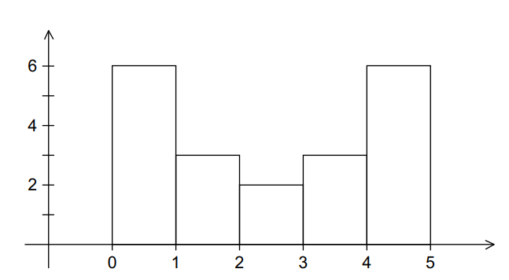
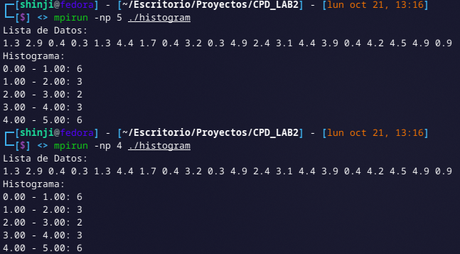
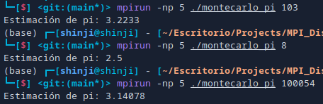
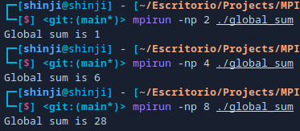
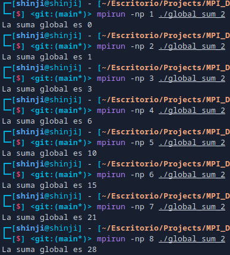
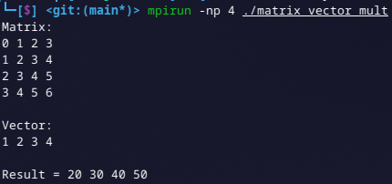
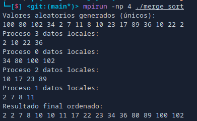

## Problema 3.1

El objetivo es implementar un programa que genere un histograma utilizando la interfaz de paso de mensajes (MPI). Esto implica que el proceso 0 se encargue de leer los datos de entrada, distribuir estos datos entre los diferentes procesos y, finalmente, imprimir el histograma resultante.

### Contexto

Según la sección 2.7.1 mencionada:

1. **Generación de Datos**: Se tiene un conjunto de datos que son números de punto flotante. En el ejemplo dado, los datos son:

   ```
   1.3, 2.9, 0.4, 0.3, 1.3, 4.4, 1.7, 0.4, 3.2, 0.3,
   4.9, 2.4, 3.1, 4.4, 3.9, 0.4, 4.2, 4.5, 4.9, 0.9
   ```

2. **Rango de Datos**: Los datos se encuentran en un rango de 0 a 5. Esto significa que se desea visualizar la distribución de estos datos en este rango específico.

3. **División en Bins**: Para crear un histograma, el rango de los datos se divide en intervalos iguales, llamados "bins". En el ejemplo, se elige dividir el rango en 5 bins.

4. **Conteo de Mediciones**: Para cada bin, se cuenta cuántos datos caen dentro de ese intervalo. Esto permite observar la distribución de los datos a través de los diferentes bins.

5. **Representación del Histograma**: Finalmente, el histograma se puede representar como un gráfico de barras donde cada barra indica el número de mediciones en cada bin.



### Implementación con MPI

- **Proceso 0**: Es responsable de leer los datos iniciales y distribuirlos entre los demás procesos.
- **Distribución de Datos**: Los datos se dividen equitativamente entre los procesos disponibles. Cada proceso calcula su parte del histograma utilizando los datos que ha recibido.

- **Reducción de Resultados**: Al final, los resultados de los histogramas locales se combinan (se reducen) en el proceso 0 para formar el histograma global.

- **Impresión del Histograma**: El proceso 0 imprime el histograma final, mostrando la cantidad de datos en cada bin.

### Explicación del Código

1.  **Inclusión de Bibliotecas**:

    - Se incluyen las bibliotecas necesarias para MPI, entrada/salida estándar y manipulaciones de vectores.

2.  **Función `calculateHistogram`**:

    - Esta función toma un conjunto de datos y cuenta cuántos de esos datos caen dentro de cada bin del histograma. Utiliza el rango de los datos y el ancho de cada bin para determinar en qué bin debe contar cada valor.

    ```cpp
    void calculateHistogram(const std::vector<double>& data, int num_bins, std::vector<int>& histogram, double min_value, double bin_width) {
        for (double value : data) {
            if (value >= min_value && value < min_value + num_bins * bin_width) {
                int bin_index = static_cast<int>((value - min_value) / bin_width);
                histogram[bin_index]++;
            }
        }
    }
    ```

3.  **Función `main`**:
    - **Inicialización de MPI**: Se inicializa el entorno MPI, obteniendo el rango y el tamaño del comunicador.
    - **Definición de Parámetros**: Se establecen el número de bins, el valor mínimo y máximo del rango de datos, y se calcula el ancho de cada bin.
    - **Lectura de Datos**: El proceso 0 inicializa un vector con los datos específicos proporcionados.
    - **Comunicación de Tamaño de Datos**: El tamaño del vector de datos se transmite a todos los procesos.
    - **Distribución de Datos**: Los datos se distribuyen entre todos los procesos usando `MPI_Scatter`.
    - **Cálculo del Histograma Local**: Cada proceso calcula su propio histograma local.
    - **Reducción de Resultados**: Se utilizan `MPI_Reduce` para combinar todos los histogramas locales en un histograma global en el proceso 0.
    - **Impresión del Histograma**: El proceso 0 imprime el histograma final, mostrando cuántos datos hay en cada bin.
    - **Finalización de MPI**: Se finaliza el entorno MPI.

### Ejecución

```bash
    mpic++ -o histogram 1.cpp
    mpirun -np <numero_procesos> ./histogram
```

### Visualización



## Problema 3.2

### Contexto

El problema se basa en una simulación para estimar el valor de π utilizando el método de Monte Carlo, que aprovecha la aleatoriedad en los lanzamientos de dardos. Aquí está la descripción detallada del escenario y la lógica detrás del método:

### 1. Configuración del Tablero

- Se tiene un tablero de dardos cuadrado con un área de

$$
2 \text{ pies} \times 2 \text{ pies}
$$

El centro del tablero (el bullseye) está en el origen del sistema de coordenadas.

- Dentro de este cuadrado, hay un círculo inscrito con un radio de 1 pie. El área del círculo es

$$
\pi \text{ pies}^2
$$

y la del cuadrado es

$$
4 \text{ pies}^2
$$

### 2. Proporción de Áreas

- La razón entre el área del círculo y el área del cuadrado es:

$$
\frac{\text{Área del círculo}}{\text{Área del cuadrado}} = \frac{\pi}{4}
$$

- Por lo tanto, si lanzamos dardos de manera aleatoria sobre el tablero, la fracción de dardos que caerán dentro del círculo debería ser aproximadamente igual a $$ \frac{\pi}{4} $$

### 3. Simulación de Lanzamientos

- Se realiza un número total de lanzamientos de dardos.
- Para cada lanzamiento, se generan dos números aleatorios **x** y **y** que representan la posición del dardo en el cuadrado, donde ambos están distribuidos uniformemente entre -1 y 1.
- Se calcula la distancia al origen utilizando la fórmula:

$$
\text{distancia cuadrada} = x^2 + y^2
$$

- Si esta distancia cuadrada es menor o igual a 1, el dardo ha caído dentro del círculo, y se incrementa un contador.

### 4. Estimación de π

- Después de realizar todos los lanzamientos, se estima el valor de π utilizando la fórmula:

$$
\pi \approx 4 \times \frac{\text{número en círculo}}{\text{total de lanzamientos}}
$$

- Este cálculo se realiza en el proceso 0.

### 5. Paralelización con MPI

- Se utilizará MPI para distribuir la carga de trabajo entre varios procesos.
- El proceso 0 leerá el número total de lanzamientos y lo difundirá a los otros procesos.
- Cada proceso realizará un número local de lanzamientos y contará cuántos dardos cayeron dentro del círculo.
- Finalmente, se utilizará `MPI_Reduce` para sumar los contadores locales de dardos que cayeron en el círculo, obteniendo así un total global que se usará para estimar π en el proceso 0.

### Ejecución

```bash
    mpic++ -o montecarlo_pi 2.cpp
    mpirun -np <numero_procesos> ./montecarlo_pi <numero_lanzamientos>
```

### Visualización



## Problema 3.3

El problema consiste en implementar un programa en MPI (Message Passing Interface) para calcular la **suma global de valores distribuidos entre múltiples procesos** utilizando una estructura en forma de árbol. Esto permite que la suma se realice de manera eficiente, minimizando la cantidad de mensajes necesarios al ir combinando valores de procesos en una jerarquía similar a un árbol binario.

Supongamos que cada proceso tiene un valor igual a su propio rango (es decir, el proceso `0` tiene un valor de `0`, el proceso `1` tiene un valor de `1`, y así sucesivamente). Esto nos ayuda a anticipar la salida, ya que la suma esperada es la suma de los primeros `N` números enteros:

$$
\text{suma esperada} = \frac{N \times (N - 1)}{2}
$$

donde `N` es el número de procesos.

### Paso 1: Caso especial en el que el número de procesos (`comm_sz`) es una potencia de dos

Cuando el número de procesos es una **potencia de dos** (por ejemplo, 2, 4, 8, etc.), podemos organizar la suma en un patrón de árbol binario. En cada "nivel" o paso de esta estructura:

- Los procesos se emparejan con otros procesos a una distancia que aumenta exponencialmente en cada ronda (2, 4, 8...).
- Cada proceso envía su valor local (o suma acumulada) a su compañero, o recibe el valor del compañero y lo suma a su propio valor.
- La cantidad de procesos activos se reduce a la mitad en cada ronda, hasta que solo el proceso 0 queda activo, conteniendo la **suma global**.

### Explicación del Código

1. **Inicialización de MPI**:

   ```cpp
   MPI_Init(&argc, &argv);
   MPI_Comm_rank(MPI_COMM_WORLD, &rank);
   MPI_Comm_size(MPI_COMM_WORLD, &comm_sz);
   ```

   Aquí, se inicializa MPI y se obtienen el rango (`rank`) de cada proceso y el número total de procesos (`comm_sz`).

2. **Inicialización de la variable `local_sum`**:

   ```cpp
   local_sum = rank;
   ```

   Cada proceso inicializa su suma local con su propio rango (por ejemplo, el proceso 0 inicializa `local_sum = 0`, el proceso 1 inicializa `local_sum = 1`, y así sucesivamente).

3. **Verificación de que el número de procesos es potencia de dos**:

   ```cpp
   if ((comm_sz & (comm_sz - 1)) != 0)
   {
       if (rank == 0)
           std::cerr << "¡El número de procesos debe ser una potencia de dos!" << std::endl;
       MPI_Finalize();
       return -1;
   }
   ```

   Esta condición usa un truco de bits para verificar que `comm_sz` sea potencia de dos, necesario para la correcta estructura en árbol. Si no es potencia de dos, el programa finaliza.

4. **Bucle principal de la suma en árbol**:

   ```cpp
   int step = 1;
   while (step < comm_sz)
   {
       if (rank % (2 * step) == 0)
       {
           int received_value;
           MPI_Recv(&received_value, 1, MPI_INT, rank + step, 0, MPI_COMM_WORLD, MPI_STATUS_IGNORE);
           local_sum += received_value;
       }
       else if (rank % (2 * step) == step)
       {
           MPI_Send(&local_sum, 1, MPI_INT, rank - step, 0, MPI_COMM_WORLD);
           break;
       }
       step *= 2;
   }
   ```

   - **Estructura de pasos** (`step`): En cada iteración, `step` se duplica. Este valor permite que los procesos se comuniquen en pares específicos para sumar sus valores.
   - **Comunicación entre pares de procesos**:
     - Procesos de rango `0, 2*step, 4*step, ...` reciben datos de sus pares (los procesos `rank + step`).
     - Procesos de rango `step, 3*step, 5*step, ...` envían sus datos y abandonan el bucle (`break`), ya que su tarea se completa después de enviar su `local_sum` al proceso superior.

5. **Proceso 0 muestra el resultado**:
   ```cpp
   if (rank == 0)
   {
       global_sum = local_sum;
       std::cout << "La suma global es " << global_sum << std::endl;
   }
   ```
   Solo el proceso 0 mantiene el `global_sum` final, que es la suma total de todos los `local_sum` en todos los procesos.

### Ejecución

```bash
    mpic++ -o global_sum 3_1.cpp
    mpirun -np <numero_procesos> ./global_sum
```

### Visualización



### Paso 2: Adaptación para manejar cualquier número de procesos

Para generalizar el programa y **manejar cualquier número de procesos** (no necesariamente una potencia de dos):

- Debemos hacer un ajuste en el patrón de suma en árbol para manejar el caso en el que un proceso no tenga un compañero en una ronda.
- En estos casos, el proceso sin compañero simplemente queda fuera de la ronda actual y espera su turno en la siguiente ronda.
- Al final, el proceso 0 contiene la suma global, incluso cuando `comm_sz` no es una potencia de dos.

Este enfoque permite calcular la suma global de manera eficiente, independientemente del número de procesos, aprovechando la estructura en árbol para reducir la cantidad de comunicaciones necesarias.

### Explicación del código

1. **Inicialización de MPI**:

   ```cpp
   MPI_Init(&argc, &argv);
   MPI_Comm_rank(MPI_COMM_WORLD, &rank);
   MPI_Comm_size(MPI_COMM_WORLD, &comm_sz);
   ```

   Aquí, cada proceso inicializa MPI, obtiene su rango (`rank`) y el número total de procesos (`comm_sz`).

2. **Inicialización de la variable `local_sum`**:

   ```cpp
   local_sum = rank;
   ```

   Cada proceso inicializa su suma local con su propio `rank`. Por ejemplo, el proceso 0 asigna `local_sum = 0`, el proceso 1 asigna `local_sum = 1`, etc.

3. **Bucle principal para la suma en árbol**:

   ```cpp
   int step = 1;
   while (step < comm_sz)
   {
       // Recibir mensaje del proceso par
       if (rank % (2 * step) == 0)
       {
           int sender = rank + step;
           if (sender < comm_sz)
           {
               int received_value;
               MPI_Recv(&received_value, 1, MPI_INT, sender, 0, MPI_COMM_WORLD, MPI_STATUS_IGNORE);
               local_sum += received_value;
           }
       }
       // Enviar mensaje al proceso par
       else if (rank % (2 * step) == step)
       {
           int receiver = rank - step;
           MPI_Send(&local_sum, 1, MPI_INT, receiver, 0, MPI_COMM_WORLD);
           break;
       }
       step *= 2;
   }
   ```

   - **Variable `step`**: La variable `step` se inicializa en 1 y se multiplica por 2 en cada iteración del bucle para que los procesos se comuniquen en pares (por ejemplo, 0 y 1, luego 0 y 2, etc.), hasta que el proceso de rango 0 recibe todos los valores.
   - **Comunicación en pares de procesos**:
     - **Recepción**: Si el proceso está en una posición de rango múltiplo de `2 * step`, está programado para recibir un valor desde el proceso `rank + step`, siempre y cuando ese rango no exceda el total (`comm_sz`).
     - **Envío**: Si el proceso es `rank = step, 3*step, ...`, envía su `local_sum` a su pareja y sale del bucle (`break`), completando su participación en la suma.

4. **Proceso 0 obtiene la suma global**:
   ```cpp
   if (rank == 0)
   {
       global_sum = local_sum;
       std::cout << "La suma global es " << global_sum << std::endl;
   }
   ```
   Al final, el proceso de rango 0 contiene la suma global de todos los valores y la imprime en pantalla.

El bucle principal realiza la **suma en estructura de árbol**, agrupando y acumulando las sumas en `local_sum` en pasos iterativos, hasta que solo el proceso 0 queda con la suma global. Esto minimiza el número de comunicaciones al evitar enviar datos innecesariamente.

### Ejecución

```bash
    mpic++ -o global_sum_2 3_2.cpp
    mpirun -np <numero_procesos> ./global_sum_2
```

### Visualización



## Problema 3.5

Este problema se enfoca en implementar la multiplicación de una **matriz cuadrada** por un **vector**, usando una distribución **por bloques de columnas** de la matriz entre varios procesos. El objetivo es dividir la matriz en bloques que se distribuyen en diferentes procesos para ejecutar la operación de forma paralela, mejorando así la eficiencia y el rendimiento.

Aquí tienes un desglose detallado del problema y su solución propuesta:

1. **Definición de la matriz y el vector**:

   - Se trabaja con una **matriz cuadrada de orden \( n \)** (es decir, con \( n \) filas y \( n \) columnas).
   - Se asume que \( n \) es **divisible uniformemente por el número de procesos**, \( \text{comm_sz} \), es decir, \( n \% \text{comm_sz} = 0 \). Esto garantiza que la matriz se puede dividir en partes iguales entre los procesos.
   - También hay un **vector** de tamaño \( n \) con el que se multiplicará la matriz.

2. **Distribución por bloques de columnas**:

   - La matriz se divide en **bloques de columnas** en lugar de filas. Esto significa que cada proceso recibe un bloque de columnas contiguas.
   - Si hay \( p \) procesos, entonces cada proceso recibe

$$
\frac{n}{p}
$$

columnas.

- Por ejemplo, si

$$
\( n = 8 \)
$$

y

$$
\( \text{comm sz} = 4 \)
$$

, entonces cada proceso recibe 2 columnas.

4. **Lectura y distribución de la matriz**:

   - El proceso 0 lee toda la matriz y el vector.
   - A continuación, el proceso 0 distribuye los bloques de columnas de la matriz a los otros procesos usando un bucle de envíos. Cada proceso recibe un bloque específico de columnas y la copia completa del vector.

5. **Multiplicación en cada proceso**:

   - Cada proceso realiza una **multiplicación local** entre su bloque de columnas y el vector.
   - El resultado de cada proceso es un vector parcial de tamaño \( \frac{n}{p} \), que corresponde a la porción de la multiplicación asociada a sus columnas.

6. **Recolección de resultados**:
   - Para obtener el resultado completo de la multiplicación de la matriz por el vector, los procesos combinan sus resultados parciales.
   - Aquí se sugiere utilizar `MPI_Reduce_scatter`, que permite reducir y dispersar los resultados de manera eficiente:
     - La función realiza una reducción de todos los valores parciales (suma de los productos parciales) y distribuye la suma en las partes correspondientes a cada proceso.

### Ejemplo de la ejecución del algoritmo

**Supongamos una matriz de 4x4, un vector de tamaño 4, y 2 procesos**:

1. **Matriz** \( A \):

   ```
   [ a11 a12 a13 a14 ]
   [ a21 a22 a23 a24 ]
   [ a31 a32 a33 a34 ]
   [ a41 a42 a43 a44 ]
   ```

2. **Vector** \( x \):

   ```
   [ x1 ]
   [ x2 ]
   [ x3 ]
   [ x4 ]
   ```

3. **Distribución de bloques**:

   - Proceso 0 recibe:
     ```
     Bloque de columnas [ a11 a12 ]
                        [ a21 a22 ]
                        [ a31 a32 ]
                        [ a41 a42 ]
     ```
   - Proceso 1 recibe:
     ```
     Bloque de columnas [ a13 a14 ]
                        [ a23 a24 ]
                        [ a33 a34 ]
                        [ a43 a44 ]
     ```

4. **Multiplicación local en cada proceso**:

   - Proceso 0 calcula una porción del resultado:
     ```
     [ (a11 * x1 + a12 * x2) ]
     [ (a21 * x1 + a22 * x2) ]
     [ (a31 * x1 + a32 * x2) ]
     [ (a41 * x1 + a42 * x2) ]
     ```
   - Proceso 1 calcula otra porción del resultado:
     ```
     [ (a13 * x3 + a14 * x4) ]
     [ (a23 * x3 + a24 * x4) ]
     [ (a33 * x3 + a34 * x4) ]
     [ (a43 * x3 + a44 * x4) ]
     ```

5. **Reducción y recolección con `MPI_Reduce_scatter`**:
   - `MPI_Reduce_scatter` combina los resultados parciales de ambos procesos, generando el resultado final de la multiplicación de la matriz por el vector, que se distribuye entre los procesos o puede recolectarse en uno solo, como el proceso 0.

Esta estrategia **reduce la carga de cálculo y comunicación** en cada proceso y aprovecha el paralelismo para acelerar la multiplicación matriz-vector. El uso de `MPI_Reduce_scatter` permite realizar de manera eficiente tanto la reducción de las sumas parciales como la dispersión de los resultados en una sola operación.

### Explicacion del Código

1. **Inicialización de MPI**:

   ```cpp
   MPI_Init(&argc, &argv);
   MPI_Comm_size(MPI_COMM_WORLD, &size);
   MPI_Comm_rank(MPI_COMM_WORLD, &rank);
   ```

   - `MPI_Init`: inicializa el entorno MPI.
   - `MPI_Comm_size`: obtiene el número total de procesos (`size`).
   - `MPI_Comm_rank`: obtiene el identificador del proceso actual (`rank`).

2. **Distribución de Filas**:

   ```cpp
   int local_n = n / size; // Número de filas asignadas a cada proceso
   std::vector<double> local_matrix(local_n * m); // Submatriz para cada proceso
   std::vector<double> local_c(local_n); // Resultado parcial para cada proceso
   ```

   - `local_n` determina cuántas filas de la matriz se asignan a cada proceso.
   - `local_matrix` contiene la submatriz que cada proceso manejará.
   - `local_c` almacena el resultado parcial de la multiplicación para cada proceso.

3. **Inicialización del Vector y la Matriz Local**:

   ```cpp
   std::vector<double> b(m); // Vector de entrada
   for (int j = 0; j < m; j++)
       b[j] = j + 1; // Inicialización del vector

   int start_row = rank * local_n;
   for (int i = 0; i < local_n; i++)
       for (int j = 0; j < m; j++)
           local_matrix[i * m + j] = (start_row + i) + j;
   ```

   - Se inicializa el vector `b` con valores de 1 a `m`.
   - La submatriz `local_matrix` se llena con valores basados en el índice del proceso.

4. **Impresión de la Matriz y el Vector en el Proceso 0**:

   ```cpp
   if (rank == 0)
   {
       std::cout << "Matrix:\n";
       for (int i = 0; i < n; i++)
       {
           for (int j = 0; j < m; j++)
               std::cout << i + j << " ";
           std::cout << "\n";
       }
       std::cout << "\nVector:\n";
       for (auto const &j : b)
           std::cout << j << " ";
       std::cout << "\n\n";
       c.resize(n); // Reservar espacio para el resultado en el proceso 0
   }
   ```

   - Solo el proceso 0 imprime la matriz y el vector iniciales y reserva espacio para el vector de resultados `c`.

5. **Distribución del Vector**:

   ```cpp
   MPI_Bcast(b.data(), m, MPI_DOUBLE, 0, MPI_COMM_WORLD);
   ```

   - `MPI_Bcast` envía el vector `b` desde el proceso 0 a todos los demás procesos.

6. **Cálculo del Producto Local**:

   ```cpp
   matrix_vector_product(local_matrix, b, local_c, local_n, m);
   ```

   - La función `matrix_vector_product` calcula el producto de la submatriz local y el vector `b`.

7. **Recolección de Resultados Parciales**:

   ```cpp
   MPI_Gather(local_c.data(), local_n, MPI_DOUBLE, c.data(), local_n, MPI_DOUBLE, 0, MPI_COMM_WORLD);
   ```

   - `MPI_Gather` recolecta los resultados parciales (`local_c`) de cada proceso y los reúne en el vector `c` del proceso 0.

8. **Impresión del Resultado en el Proceso 0**:

   ```cpp
   if (rank == 0)
   {
       std::cout << "Result = ";
       for (auto const &i : c)
           std::cout << i << " ";
       std::cout << "\n";
   }
   ```

   - El proceso 0 imprime el resultado final de la multiplicación de la matriz por el vector.

9. **Finalización de MPI**:

   ```cpp
   MPI_Finalize();
   ```

   - `MPI_Finalize` cierra el entorno MPI y libera los recursos asociados.

10. **Producto de matriz por vector**:

    - Se toma la submatriz local y el vector como entrada.
    - Cada entrada del resultado `result[i]` se calcula como la suma del producto de la fila `i` de la submatriz local con el vector `vector`.

    ```cpp
    void matrix_vector_product(const std::vector<double> &matrix, const std::vector<double> &vector, std::vector<double> &result, int rows, int cols)
    {
        for (int i = 0; i < rows; i++)
        {
            result[i] = 0.0;
            for (int j = 0; j < cols; j++)
                result[i] += matrix[i * cols + j] * vector[j];
        }
    }
    ```

### Ejecución

```bash
    mpic++ -o matrix_vector_mult 4.cpp
    mpirun -np <numero_procesos> ./matrix_vector_mult
```

### Visualización



## Problema 3.8

El problema de **ordenación paralela por mezcla** (parallel merge sort) implica dividir un conjunto de claves entre varios procesos, de manera que cada proceso pueda trabajar en una parte de la lista de forma independiente y en paralelo. A continuación se describe cómo se desarrolla este proceso.

### Descripción del Proceso

1. **Asignación de Claves**:

   - Comienza con **n/comm_sz** claves asignadas a cada proceso, donde n es el número total de claves y comm_szes el número de procesos involucrados.
   - Cada proceso generará su propia lista de números enteros aleatorios.

2. **Ordenación Local**:

   - Cada proceso ordena su lista local utilizando un algoritmo de ordenación (como quicksort o mergesort).
   - Esto se realiza de manera independiente en cada proceso.

3. **Comunicación en Árbol**:

   - Para combinar todas las listas ordenadas, se utiliza una comunicación estructurada en forma de árbol, similar a la que se emplea para realizar una suma global.
   - Cuando un proceso recibe las claves de otro proceso, fusiona esas nuevas claves en su lista de claves ya ordenadas.

4. **Recolección en el Proceso 0**:
   - Al final del proceso de fusión, todas las claves ordenadas se reúnen en el proceso 0.
   - Este proceso imprimirá la lista final de claves ordenadas.

### Explicación del Código

1. **Inicialización de MPI**:
   - `MPI_Init` inicializa MPI.
   - `MPI_Comm_size` y `MPI_Comm_rank` obtienen el número de procesos y el rango del proceso actual.

```cpp
    std::vector<int> global_data;
    if (rank == 0)
    {
        std::set<int> unique_numbers;
        std::default_random_engine generator;
        std::uniform_int_distribution<int> distribution(1, 100);
        while (unique_numbers.size() < n)
        {
            unique_numbers.insert(distribution(generator));
        }
        global_data.assign(unique_numbers.begin(), unique_numbers.end());
        std::cout << "Valores aleatorios generados (únicos):\n";
        for (const auto &value : global_data)
        {
            std::cout << value << " ";
        }
        std::cout << std::endl;
    }
```

2. **Generación de Números Aleatorios Únicos en Proceso 0**:
   - Proceso 0 genera `n` números aleatorios únicos, utilizando un `std::set` para asegurar que no se repitan.
   - Luego, estos números se imprimen y se distribuyen entre los procesos.

```cpp
    global_data.resize(n);
    MPI_Bcast(global_data.data(), n, MPI_INT, 0, MPI_COMM_WORLD);
```

3. **Difusión del Vector Completo**:
   - Se utiliza `MPI_Bcast` para enviar los datos generados por el proceso 0 a todos los procesos.

```cpp
    int local_n = n / size;
    std::vector<int> local_data(local_n);
    for (int i = 0; i < local_n; i++)
    {
        local_data[i] = global_data[rank * local_n + i];
    }
    std::sort(local_data.begin(), local_data.end());
    std::cout << "Proceso " << rank << " datos locales:\n";
    for (const auto &value : local_data)
    {
        std::cout << value << " ";
    }
    std::cout << std::endl;
```

4. **Asignación y Ordenación Local**:
   - Cada proceso recibe una parte del `global_data` (su bloque de datos), de tamaño `local_n`.
   - Ordena sus datos localmente usando `std::sort`.
   - Cada proceso imprime sus datos locales para verificación.

```cpp
    std::vector<int> merged_data;
    if (rank == 0)
    {
        merged_data = local_data;
        for (int i = 1; i < size; i++)
        {
            std::vector<int> temp_data(local_n);
            MPI_Recv(temp_data.data(), local_n, MPI_INT, i, 0, MPI_COMM_WORLD, MPI_STATUS_IGNORE);
            std::vector<int> temp_merged_data(merged_data.size() + temp_data.size());
            merge(merged_data, temp_data, temp_merged_data);
            merged_data = std::move(temp_merged_data);
        }
    }
    else
    {
        MPI_Send(local_data.data(), local_n, MPI_INT, 0, 0, MPI_COMM_WORLD);
    }
```

5. **Fusión en Árbol en Proceso 0**:
   - Proceso 0 recibe las listas ordenadas de los demás procesos usando `MPI_Recv`.
   - Cada lista recibida se fusiona con el `merged_data` (el conjunto de datos previamente fusionados).
   - La función `merge` ordena y combina dos vectores en uno solo.

```cpp
    if (rank == 0)
    {
        std::cout << "Resultado final ordenado:\n";
        for (const auto &value : merged_data)
        {
            std::cout << value << " ";
        }
        std::cout << std::endl;
    }

    MPI_Finalize();
    return 0;
```

6. **Impresión Final**:
   - Proceso 0 imprime el resultado final después de la fusión.

### Ejecución

```bash
    mpic++ -o merge_sort 5.cpp
    mpirun -np <numero_procesos> ./merge_sort
```

### Visualización


